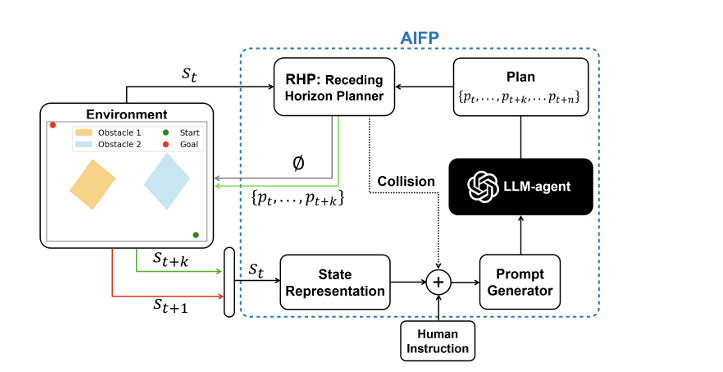

# Obstacle-Aware-Path-Planning-via-LLMs

## Project Overview

This project explores the use of Large Language Models (LLMs) to enable intelligent and adaptive pathfinding for robots in dynamic environments. By leveraging the language understanding and reasoning capabilities of LLMs, the system generates navigation plans, interprets environmental feedback, and adjusts trajectories in real time. The goal is to develop a flexible planning framework that allows robots to make informed decisions, avoid obstacles, and reach their goals efficiently.

---

## Architecture



---

## Technologies

- Pygame — Visualization & Simulation Environment
- LLaMA — Used for natural language-based reasoning and planning
- Adaptive Iterative Feedback Prompting (AIFP) — Framework to integrate LLM outputs with real-time feedback
- Python — Primary programming languages

---

## Project Initialization

1. Clone this repository

```bash
git clone https://github.com/phyc11/Obstacle-Aware-Path-Planning-via-LLMs.git
```

```bash
cd Obstacle-Aware-Path-Planning-via-LLMs
```

2. To run fixed_obstacle.py

- Create account and api key in [https://console.groq.com/home](https://console.groq.com/home)
- Enter your api_key in file fixed_obstacle.py

```bash
python fixed_obstacle.py
```

3. To run fixed_obstacle.py

- Create account and api key in [https://console.groq.com/home](https://console.groq.com/home)
- Enter your api_key in file moving_obstacle.py

```bash
python moving_obstacle.py
```
